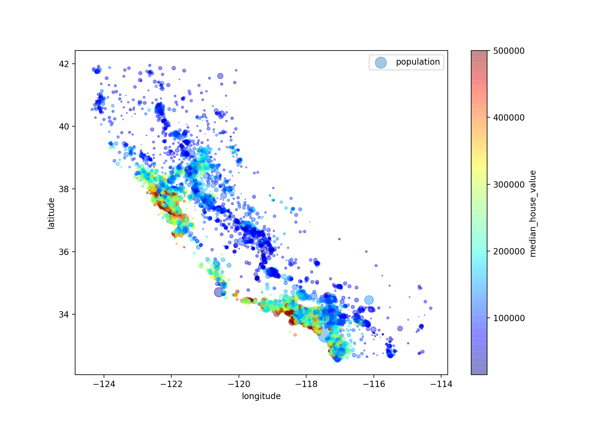
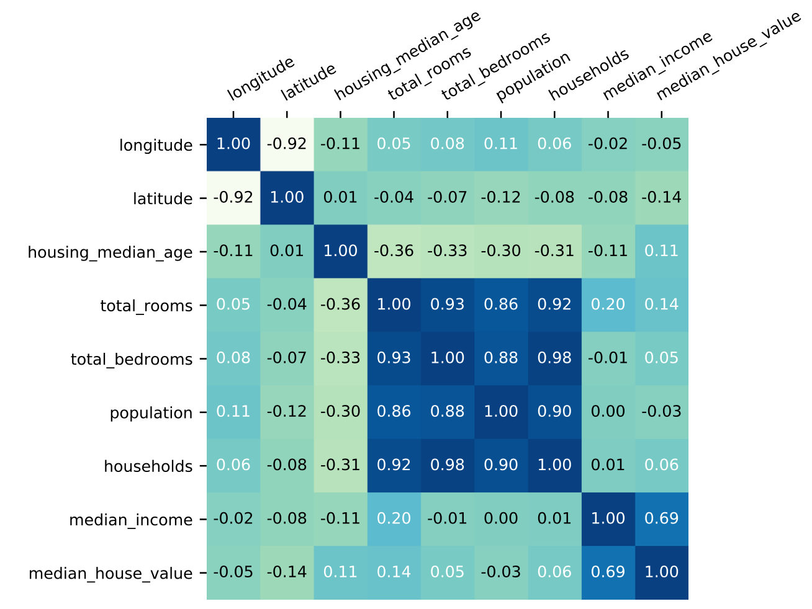

## Chapter 2 End-to-End Machine Learning Project 

* ### Basic Concept

  * A sequence of **data processing components** is called a data *pipeline*. 

  * regression task is a typical supervised learning task for each instance with the expected output.

  * $\ell_p$ norm

    * $||\textbf{v}||_k = (|\textbf{v}_0|^k+|\textbf{v}_1|^k+\ldots+|\textbf{v}_n|^k)^{1/k}$  

    * $\ell_0$ gives the number of nonzero elements in the vector

    * $\ell_\infty$ gives the maximum **absolute** value in the vector 

    * the higher the norm index, the more it focuses on large values and neglects small ones.

      

* ### Download the Data

  * set the path using `os`

    ```python
    import os
    your_path = os.path.join("directory","sub_directory")
    
    # create path with os.makedirs
    # if your directory contains unexisting directory
    # os.mkdir will report ERROR, so use makedirs
    # exist_ok=True means if the target dirt exist, it's ok
    # otherwise, it will report ERROR
    os.makedirs(housing_path, exist_ok=True)
    ```

  * download the **url** link

    ```python
    import urllib
    DOWNLOAD_ROOT = your_url_link
    urllib.request.urlretrieve(DOWNLOAD_ROOT, save_path) 
    ```

  * **using `pandas` to read `csv` file will save a lot of time and it also empowers you to do lots of fancy things.**

    ```python
    df = pd.read_csv(csv_path) # return pandas.core.frame.DataFrame
    ```

    * `df.head(n)` looks at the top rows

    * `df.info()` gets a quick **description**(not statistic info) of the data 

    * `df["column_name"].value_counts()` tells what **categories** exist and how many districts belong to each category (for discrete data type).

    * `df.describe() `shows a summary of the **numerical attributes**. The 25%, 50%, and 75% rows show the corresponding *percentiles*, e.g. `25% housing_median_age = 18` means 25% of the districts have a housing_median_age **lower than** 18.

    * `df.hist(bins=n)` plots a histogram for each numerical attribute 

    * `df.reset_index()` adds an index column

      

* ### Create a Test Set

  * use random methods to split the dataset is unstable. Over time, you  algorithms will get to see the whole dataset, which should be avoided. 

  * use `train_test_split` from `sklearn`

    ```python
    from sklearn.model_selection import train_test_split
    train_set, test_set = train_test_split(housing, test_size=0.2, random_state=42) 
    ```

  * **Stratified Shuffle Split** 

    * It is important to have a sufficient number of instances in your dataset for **each stratum**.

    * use `pd.cut` to create a category attribute with `n` categories. 

      ```python
      housing["income_cat"] = pd.cut(housing["median_income"], 
             bins=[0., 1.5, 3.0, 4.5, 6., np.inf], 
             labels=[1, 2, 3, 4, 5]) 
      ```

    * use `StratifiedShuffleSplit` to perform stratified sampling

      ```python
      from sklearn.model_selection import StratifiedShuffleSplit 
      
      # build generator first
      split = StratifiedShuffleSplit(n_splits=1, test_size=0.2, random_state=42) 
      
      # split.split(target_dataset,target_variable)
      # Stratification is done based on the target_variable labels.
      for train_index, test_index in split.split(housing, housing["income_cat"]): 
      		strat_train_set = housing.loc[train_index] 
          strat_test_set = housing.loc[test_index] 
      ```


* ### Visualizing Geographical Data 

  * **`DataFrame` has bulit-in plot function!**

    * ⚠️ note that the we only need to give `x,y` with name itself instead of the data series, e.g. `housing["variable_name"]`

    ```python
    # s : The radius of each circle
    # c : the color
    # cmap : predefined color map called jet, which ranges from blue(low value) to red(high prices)
    housing.plot(kind="scatter", x="longitude", y="latitude", alpha=0.4, s=housing["population"]/100, label="population", figsize=(10,7), c="median_house_value", cmap=plt.get_cmap("jet"), colorbar=True,) 
    plt.legend() 
    ```




* ### Looking for Correlations 

  * use `df.corr()` to compute the *[Pearson correlation coefficient](https://en.wikipedia.org/wiki/Pearson_correlation_coefficient)* (**linear correlation**). 

    * when it is close to $1$, it means that there is a strong positive correlation. 
    * when it is close to $0$, it means that there is no linear correlation.
    * when it is close to $-1$, it means that there is a strong negative correlation. 

    It returns a matrix as plotted below

    


* ### Experimenting with Attribute Combinations

  ```python
  housing["rooms_per_household"] = housing["total_rooms"]/housing["households"] 
  housing["bedrooms_per_room"] = housing["total_bedrooms"]/housing["total_rooms"] 
  housing["population_per_household"]=housing["population"]/housing["households"]
  ```


* ### Prepare the Data for Machine Learning Algorithms 

  * separate the features and the label.


* ### Data Cleaning

  * cope with missing features 

    * get rid of the corresponding rows. 

      ```python
      housing.dropna(subset=["total_bedrooms"], inplace=True) 
      ```

    * get rid of the whole attribute. 

      ```python
      housing.drop("total_bedrooms", axis=1, inplace=True) 
      ```

    * set the values to some value (zero, the mean, the median, etc.). 

      ```python
      median = housing["total_bedrooms"].median()
      housing["total_bedrooms"].fillna(median, inplace=True)
      
      # sklearn way
      from sklearn.impute import SimpleImputer 
      imputer = SimpleImputer(strategy="median")
      X = imputer.fit_transform(housing_num)
      ```

      ⚠️ Don’t forget to **save the median value** that you have computed. You will need it later to **replace missing values in the test set** when you want to evaluate your system, and also once the system goes live to replace missing values in new data. 

    * use sklearn `impute` 

      ```python
      from sklearn.impute import SimpleImputer 
      imputer = SimpleImputer(strategy="median")
      housing_num = housing.drop("ocean_proximity", axis=1)# not for non-numerical data type
      imputer.fit(housing_num)
      ```


* ### Scikit-Learn Design

  |             | description                                                  | input                                                        | function                                                     |
  | ----------- | :----------------------------------------------------------- | ------------------------------------------------------------ | ------------------------------------------------------------ |
  | Estimator   | Any objects that can estimate some **parameters** based on a dataset is called an estimator. | it takes only **a dataset** as a parameter (or two for supervised learning algorithms; the second dataset contains the **labels**) | The estimation itself is performed by calling `fit()` method. |
  | Transformer | Some estimators can also transform a dataset                 | dataset to transform                                         | `transform()`<br>`fit_transform()`                           |
  | Predictor   | some estimators, given a dataset, are capable of making predictions | feature vectors                                              | `predict()`<br>`score()`                                     |


* ### Handling Text and Categorical Attributes 

  * **Ordinal Encoding**: use `OrdinalEncoder` to convert the categories from text to numbers. 

    ```python
    from sklearn.preprocessing import OrdinalEncoder
    ordinal_encoder = OrdinalEncoder()
    housing_cat_encoded = ordinal_encoder.fit_transform(housing_cat)
    # return a numpy array
    ```

  * **One-hot Encoding**

    If a categorical attribute has a large number of possible categories (i.e. we have 198 countries.), using one-hot encoding is inefficient. We can do:

    * **replace the categorical input with useful numerical features related to the categories**: for example, you could replace the `ocean_proximity` feature with the distance to the ocean (similarly, a `country code` could be replaced with the `country’s population` and `GDP per capita`) 
    * use Embedding.


* ### Custom Transformers 

  ```python
  from sklearn.base import BaseEstimator, TransformerMixin
  class CombinedAttributesAdder(BaseEstimator, TransformerMixin):
  		def __init__(self, add_bedrooms_per_room = True): 
        # no *args or **kargs
      def fit(self,X,y=None):
          return self  # nothing else to do
      def transform(self,X):
          ...
  ```

  |                     | `fit` |   `transform`    |                `fit_transform`                |
  | :-----------------: | :---: | :--------------: | :-------------------------------------------: |
  | should we write it? |  Yes  |       Yes        | No<br> (add TransformerMixin as a base class) |
  |  what it returns?   | self  | transformed data |               transformed data                |


* ### Feature Scaling

  |           |                       Min-max scaling                        |          Standardization          |
  | :-------: | :----------------------------------------------------------: | :-------------------------------: |
  |  formula  | $X_{std}=\frac{X-X.\min(\rm{axis}=0)}{X.\max(\rm{axis}=0)-X.\min(\rm{axis}=0)}$ $X_{scaled}=X_{std}\times(\max-\min)+\min$ | $X_{scaled}=\frac{X-\mu}{\sigma}$ |
  |   range   |                    $[0,1]$ or given range                    |             not bound             |
  | stability |  will be affected by the outliers.<br> (e.g. [1,3,4,2,100])  |       not be much affected        |
  | Function  |                        `MinMaxScaler`                        |         `StandardScaler`          |

  **⚠️  fit the scalers to the Training data only** 


* ### Transformation Pipelines 

  * The Pipeline constructor takes a list of `(name,estimator)` pairs defining a sequence of steps.  

  ```python
  from sklearn.pipeline import Pipeline
  from sklearn.preprocessing import StandardScaler
  num_pipeline = Pipeline([
  		('imputer', SimpleImputer(strategy="median")), #(name,estimator)
    	('attribs_adder', CombinedAttributesAdder()),  #(name,estimator)
    	('std_scaler', StandardScaler()),              #(name,estimator)
  ])
  housing_num_tr = num_pipeline.fit_transform(housing_num)
  ```

  * When you call the pipeline’s `fit()` method, it calls `fit_transform()` sequentially on all transformers, passing the output of each call as the parameter to the next call until it reaches the final estimator, for which it calls the `fit()` method. 

  * **`ColumnTransformer`**

    * **a single transformer which is able to handle all columns (no matter numerical type or category type), applying the appropriate transformations to <u>each column</u>.**
    * `[(name, transformer, names of columns)...]`

    ```python
    from sklearn.compose import ColumnTransformer 
    
    num_attribs = list(housing_num)# return the column name list of Dataframe
    cat_attribs = ["ocean_proximity"]
    full_pipeline = ColumnTransformer([
    		("num", num_pipeline, num_attribs), 
      	("cat", OneHotEncoder(), cat_attribs),
    ])
    housing_prepared = full_pipeline.fit_transform(housing)
    ```

  * `list(Dataframe)` returns the **column name** list of Dataframe

    `list(Series)` returns the **values** list of Series.


* ### Better Evaluation Using Cross-Validation 
  * `cross_val_score()` Scikit-Learn’s *K-fold cross-validation*. 

    ```python
    from sklearn.model_selection import cross_val_score
    scores = cross_val_score(tree_reg, housing_prepared, 
                             housing_labels,
                             scoring="neg_mean_squared_error", 
                             cv=10) # split into 10 distinct subsets.
    
    tree_rmse_scores = np.sqrt(-scores)
    ```

  * **Scikit-Learn’s cross-validation features expect a utility function (greater is better) rather than a cost function (lower is better)**, so the scoring function is actually the opposite of the MSE (i.e., a negative value), which is why the preceding code computes `-scores` before calculating the square root. 


* ### Fine-Tune Your Model 

  * **Grid Search** (where the parameters are discrete)

    ```python
    from sklearn.model_selection import GridSearchCV
    param_grid = [
    		{'n_estimators': [3, 10, 30], 'max_features': [2, 4, 6, 8]},
    		{'bootstrap': [False], 'n_estimators': [3, 10], 'max_features': [2, 3, 4]},
    ]
    forest_reg = RandomForestRegressor()
    grid_search = GridSearchCV(forest_reg, param_grid, cv=5, 	
                               scoring='neg_mean_squared_error',
                               return_train_score=True) 
    
    grid_search.fit(housing_prepared, housing_labels)
    
    #output
    grid_search.best_params_
    grid_search.best_estimator_
    grid_search.cv_results_
    ```

  * **Random Search** (where the parameters are from a certain distribution )

    ```python
    from sklearn.model_selection import RandomizedSearchCV
    from scipy.stats import expon, reciprocal
    
    
    # Note: gamma is ignored when kernel is "linear"
    param_distribs = {
            'kernel': ['linear', 'rbf'],
            'C': reciprocal(20, 200000),
            'gamma': expon(scale=1.0),
        }
    
    svm_reg = SVR()
    rnd_search = RandomizedSearchCV(svm_reg, param_distributions=param_distribs,
                                    n_iter=50, cv=5,scoring='neg_mean_squared_error',
                                    verbose=2, random_state=42)
    rnd_search.fit(housing_prepared, housing_labels)
    ```

    

* ### Evaluate Your System on the Test Set 

  * run your `full_pipeline` to transform the data, **call `transform()`, *not* `fit_transform()`— you do not want to fit the test set!**